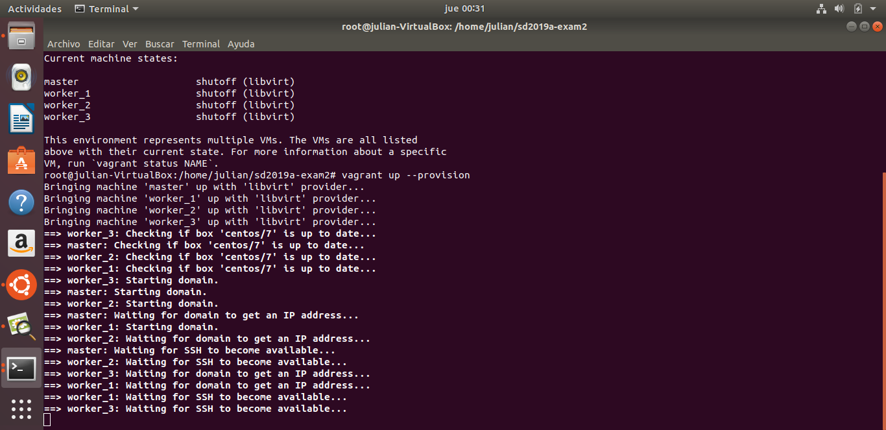

# sd2019a-exam2
Repository for the exam2

**Segundo Examen Parcial**  

**Universidad Icesi**  

**Materia:** Sistemas Distribuidos  
**Nombres:** Julián Niño, Santiago Fajardo , Steven Montealegre  
**Código:** A00328080,        ,
**Correos:** juliannino01@hotmail.com   
**URL:** https://github.com/julianNinoo/sd2019a-exam2/NinoBranch

**Descripción**  

En este Segundo Examen Parcial se empleo vagrant y ansible para el aprovisionamiento de las maquinas. En el vagrant se puede observar la creación de los discos de 5 GB  para cada nodo y la configuración de las  caracteristicas de cada maquina. En el ansible se puede  observar la instalación de Docker, Docker-Compose , Docker-Swarm y Gluster para todos los nodos. Es importante destacar que la ejecución del ansible se hace gracias al Vagrantfile.

**Imagenes de la correcta configuración del Vagrant y del Ansible** 

 

 

**Problemas encontrados** 
Al realizar el parcial en una maquina virtual y no tener instalado nada, se presentaban errores por libvirtd, vagrant, ansible y la imagen del centos/7. Entonces se debio hacer su debida instalación.

**Referencias** 
Para  ansible se utilizó: https://lastviking.eu/install_docker_on_centos_with_ansible.html
Para vagrant se utilizó:https://github.com/ICESI/ds-docker/blob/master/09_docker_swarm/00_nodes_deploy/Vagrantfile https://github.com/atSistemas/vagrant-docker-swarm-cluster/blob/master/Vagrantfile
