# sd2019a-exam2
Repository for the exam2

# Segundo Examen Parcial  

**Universidad Icesi**  

**Materia:** Sistemas Distribuidos  
**Nombres:** Julián Niño, Santiago Fajardo , Steven Montealegre  
**Código:** A00328080,        ,
**Correos:** juliannino01@hotmail.com   
**URL:** https://github.com/julianNinoo/sd2019a-exam2/NinoBranch

# Descripción:  

En este Segundo Examen Parcial se empleo vagrant y ansible para el aprovisionamiento de las maquinas. En el vagrant se puede observar la creación de los discos de 5 GB  para cada nodo y la configuración de las  caracteristicas de cada maquina. En el ansible se puede  observar la instalación de Docker, Docker-Compose , como tambien la configuración de Docker-Swarm y Gluster para todos los nodos. Es importante destacar que la ejecución del ansible se hace gracias al Vagrantfile.

Para la ejecución de los diferentes playbook , se decidio tener un archivo de configuración para cada tema desarrollado ya que si se ejecuta todo en el mismo playbook se formarán conflictos porque primero se ejecuta el master. Por ejemplo en el caso del gluster al ejecutar el master la instrucción  "gluster volume create swarm-vols replica 4 192.168.56.110:/gluster/data 192.168.56.111:/gluster/data 192.168.56.112:/gluster/data 192.168.56.113:/gluster/data force" , esto no seá posible ya que no existen en cada uno de los nodos las direcciones /gluster/data. Por esta razón en otro archivo en nuestro caso llamado permisos se crean estas rutas en todos los hosts y ahí si en el correspondiente archivo se ejecuta el comando mencionado anteriormente. 

La instrucción para ejecutar desde el Vagrantfile los diferentes playbook se pueden ver en las sigientes lineas: 

config.vm.provision "ansible" do |ansible|
 ansible.inventory_path = 'hosts'
 ansible.playbook = "docker/instalaciondocker/dependenciasdocker.yml"
 end

En "ansible.playbook ="  irá el archivo que queramos ejecutar. En nuestro caso se instaló y se configuró:

# Docker- Docker Compose:

En el archivo dependenciasdocker.yml se descarga e instala docker y docker-compose. Posteriormente se elimina el script de instalación y se pregunta si ya está instaladas estas dependencias en cada nodo para no volverlo a hacer. 

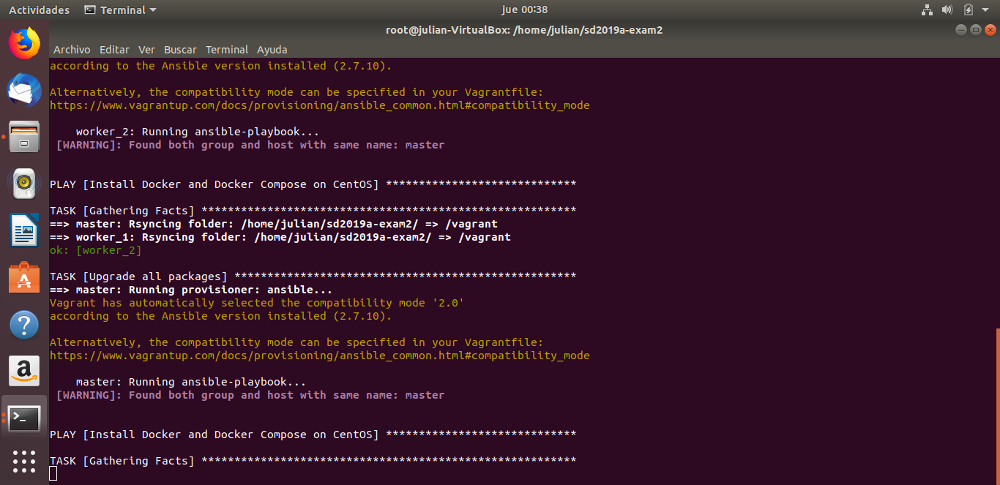 

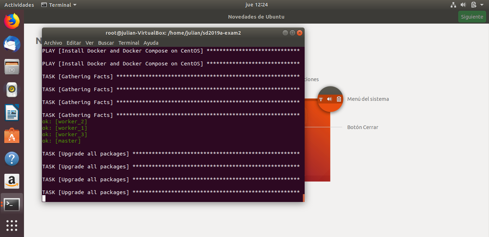

# Gluster

Se instaló gluster en el archivo gluster.yml. Posteriormente en el archivo permisos.yml se concedieron unos comandos que más adelante en la sección de problemas encontrados se explicará por qué se insertaron en cada host, en este mismo archivo se crean las carpetas necesarias y se hace la asignación del contenido del disco para la ejecución del gluster. Por último en el archivo montajegluster se añade cada nodo al master.

Captura de la creación de la partición y del montaje swarm de localhost:/swarm-vols /swarm/volumes en todos los nodos 

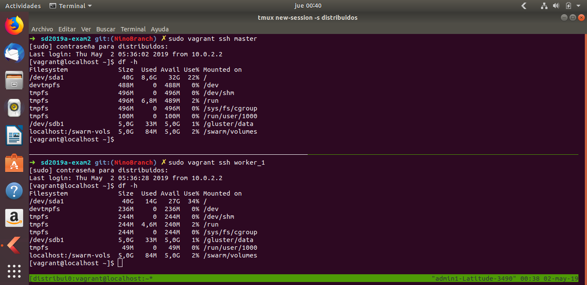 

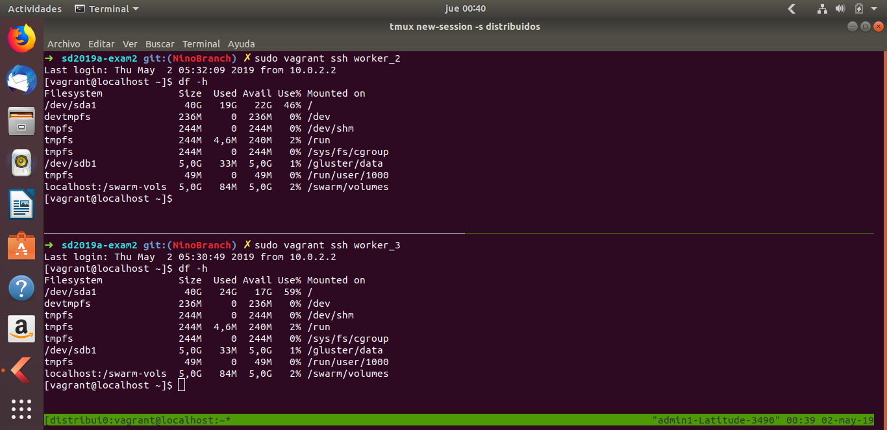 

Captura de la unión de todos los nodos en el gluster.

 

# Swarm: 

Para conectar el master y los nodos con docker-swarm (Token) se utlizó scp para tomar el token del nodo master. En esta parte se generaron problemas ya que al hacer scp al master se generaba un PERSMISION DENIED. esta problematica se dió por:

1- el archivo txt que contiene el token no tenia los permisos necesarios
2- Habiá problemas de llaves ssh 

Por esta razón en el vagrant se configuraron las llaves para poder hacer el scp y tambien en el archivo de swarm.yml se le dio persmisos al archivo txt que contiene el token. 

En la siguiente imagen se muestra la configuracion de llaves en el Vagrantfile

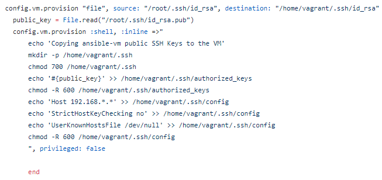

En la siguiente imagen se muestra el docker swarm configurado:

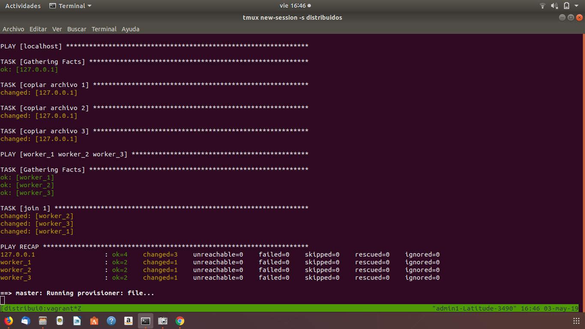

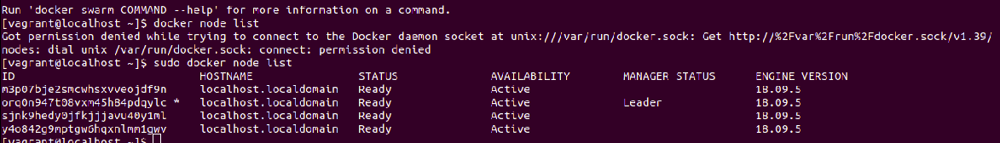

## Desarrollo aplicación web

### Desarrollo mediante PHP

Para el desarrollo de la aplicación se utilizo una imagen ya establecida en Docker Hub la cual parte de una referencia de PHP con apache. De esta manera podremos establecer conexión con el servidor de bases de datos, el cual mencionaremos mas adelante. Además, podremos visualizarlo mediante un navegador web y próximamente consultar los logs.

`FROM php:7.0-apache`

Además de ello se tuvo que agregar dos dependencias con la cual obtenemos las funciones correspondientes para hacer la conexión y las consultas y se ve reflejado en el Dockerfile a través del siguiente comando:

`RUN docker-php-ext-install mysqli && docker-php-ext-enable mysqli`

Luego de ello se pasa la aplicación como tal a la carpeta HTML del contenedor:

`COPY web /var/www/html`

Y como punto final de nuestro Dockerfile vamos a exponer nuestra aplicación por el puerto 80:

`EXPOSE 80`

Y finalmente encontramos la aplicación dentro de la carpeta web la cual esta en formato PHP. En donde hacemos la conexión con la base de datos, requerimos todos los datos de la tabla y luego creamos el formato para que lo muestre como si fuera una tabla.

## Desarrollo Base de Datos

### Desarrollo MySQL

Para el desarrollo de la aplicación utilizamos una imagen definida en el Docker Hub con MySQL, no obstante, tuvimos que definir una versión anterior de esta dado que al m omento de hacer la conexión por parte del cliente el método de autentificación usado por PHP en la aplicación era el que usaba MySQL en sus versiones anteriores, porque en la versión actual el método de autentificación es diferente. Por lo que si usábamos la versión mas reciente de MySQL no nos dejaba ingresar a la base de datos.

`FROM mysql:5.5.62`

Para establecer una base de datos iniciada hacemos los siguientes pasos:

`ENV MYSQL_DATABASE Escuela`

Comando que crea una base de datos en nuestro caso llamada Escuela.

`COPY ./scripts.sql /docker-entrypoint-initdb.d/`

`COPY ./scriptsadd.sql /docker-entrypoint-initdb.d/`

Por último, estos dos comandos copian dos scripts los cuales tienen los comandos correspondientes para inicializar la base de datos.

Otro aspecto que hay que tener en cuenta es que en el ambiente de pruebas se creo un volumen al cual hacíamos referencia en el Dockerfile de esa manera así el nodo se cayera la información iba a estar segura y no se iba a perder.

`VOLUME /var/lib/mysql`

## Evidencia del funcionamiento

En este primer caso hacemos una consulta buena, es decir le pedimos al navegador la página de inicio o índex en donde se encuentra todo el código de la aplicación que hace la respectiva consulta. Como se puede ver la consulta se efectúa correctamente.

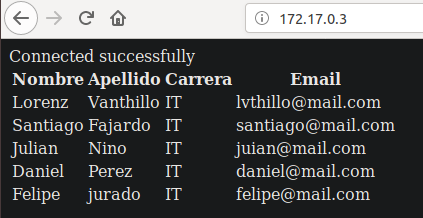

Ahora vamos a realizar una consulta que no existe. Como podemos ver el servidor apache nos envía el correspondiente mensaje 404 lo que indica este error es que se trata de un enlace roto, defectuoso o que ya no existe y que, por lo tanto, no es posible navegar por él. 

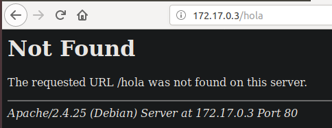

A continuación mostramos como se inicia el contenedor y luego mediante este procedimiento podemos ver los logs que esta generando nuestra aplicación.

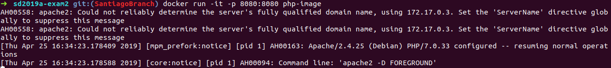

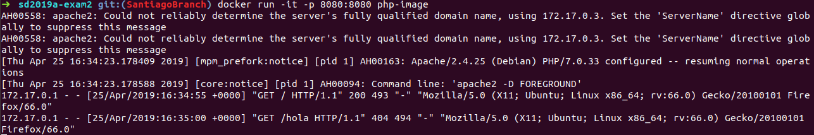

# Fluentd:  
Fluentd es una librería de código abierto que permite la colección de logs, los parsea (añade un formato) y los envía o escribe en una base de datos, a S3, Hadoop o otros fluentd's. 
De la configuración del stack EFK, Fluentd es la única herramienta que tiene una carpeta destinada a su configuración. Basicamente utilizamos la misma configuración vista en clase y añadimos en el docker-compose algunas reglas en la zona de drivers de la aplicación php para que fluentd escuchara el tráfico de paquetes por el puerto 80.  
El archivo de configuración de Fluentd posee 4 zonas: Source, Filter, Match y System.

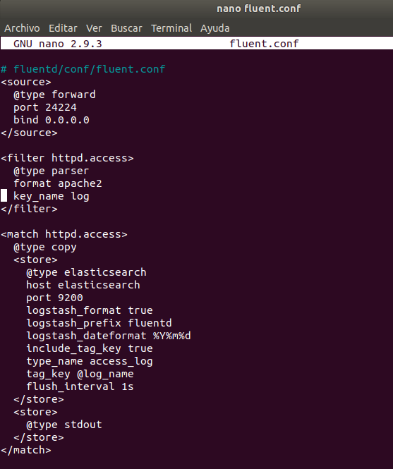  

**Zona source** Los plugins de entrada estándar de Fluentd son http y forward. Http convierte a fluentd en un punto final HTTP para aceptar mensajes HTTP entrantes. Mientras que, forward convierte a fluentd en un punto final TCP para aceptar paquetes TCP. Además pueden utilizarse ambas fuentes al mismo tiempo; Cada directiva de origen debe incluir un @typeparameter. El cual especifica qué complemento de entrada usar. **Zona filter** Es la zona para el procesamiento de información, aquí añadimos formato a los logs y podemos concatenarlos con otras cadenas. **Zona match** Esta zona busca eventos con etiquetas de coincidencia y los procesa. El uso más común de esta zona es enviar eventos a otros sistemas (por esta razón, los complementos que corresponden a la directiva match se denominan "complementos de salida"). Los plugins de salida estándar de Fluentd incluyen filey forward. 

# Elastic Search, Kibana:  
La configuración de estas dos tecnologias se llevó a cabo en el docker-compose, archivo en el cual obtenemos las imagenes, configuramos puertos de comunicación y los ambientes.  

  
 
  

# Problemas encontrados 

- Al realizar el parcial en una maquina virtual y no tener instalado nada, se presentaban errores por libvirtd, vagrant, ansible y la imagen del centos/7, entonces se debio hacer su debida instalación. 

- La maquina virtual colapsó  ya que a cada nodo tegnia asginado asignando  1 GB de RAM  y la maquina virtual solo tenía dos de RAM. Para solucionar esto se debió poner menos memoria RAM en cada nodo 

- Al trabajar en una maquina virtual con libvirt, presentaba el siguiente error de Dominio: 

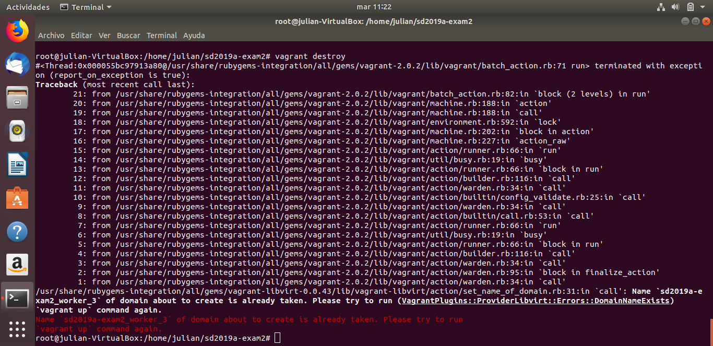

Para solucionar esto se debió ingresar el comando virsh list -all y luego destruir el dominio de todas las maquinas de esta lista con:                          virsh destroy nombredemaquina y virsh undefine nombredemaquina 
Despues de esto se debio destruir las maquinas con vagrant destroy y despues vagrant up, en algunas ocasiones tocó eliminar la carpeta .vagrant con rm -rf .vagrant. Cabe aclarar que este problema se presentó porque el proveedor era libvirt.

- En el momento de asignar el contenido de la partición solo se hacia en el worker_3 esto sucedia porque se tenia un problema en un end en el Vagrantfile, este end solo permitia hacer el aprovisionamiento en este worker y no en todos los nodos. 

- Cuando se querian añadir nodos al gluster con sudo gluster peer probe node2 aparecía el error : -transport-endpoint-is-not-connected. Despues de buscar se pudo concluir que el problema era por puertos del firewalld, por es razón se añaden permisos en el archivo permisos.yml de la carpeta gluster.

- Como se mencionó anteriormente en el docker-swarm se presentaba problemas de scp por esa razón se añadio esas lineas en el Vagrantfile.

- Otro problema encontrado fue en el momento de hacer git push desde nuestra maquina, aparecia que la rama estaba actualizada. Por esta razón se debio utilizar el comando git add para añadir los archivos nuevos, por ejemplo, gitadd nombredearchivo

# Referencias 
Para vagrant se utilizó:
https://github.com/ICESI/ds-docker/blob/master/09_docker_swarm/00_nodes_deploy/Vagrantfile  y 
https://github.com/atSistemas/vagrant-docker-swarm-cluster/blob/master/Vagrantfile

Para la instalación de Docker y Docker-Compose se utilizó:
 https://lastviking.eu/install_docker_on_centos_with_ansible.html
 
Para la instalación y configuración del gluster se utilizó:
https://github.com/ICESI/ds-glusterfs/blob/master/00_nodes_deploy/install/glusterfs.sh y  
https://stackoverflow.com/questions/33773026/unable-to-peer-probe-in-glusterfs-transport-endpoint-is-not-connected

