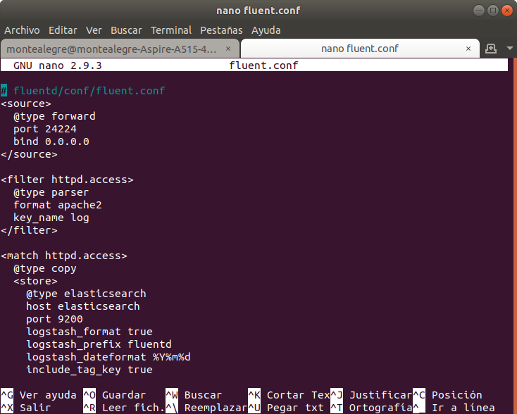

# sd2019a-exam2
#### Segundo parcial Sistemas Distribuidos. 

**Universidad ICESI, Cali - Colombia**  

**Materia:** Sistemas Distribuidos  
**Alumno:** Steven Montealegre Gutiérrez  
**Código:** A00014976  
**Equipo de trabajo:** Julián Niño, Santiago Fajardo  
**Correo:** james.montealegre@correo.icesi.edu.co   
**URL:** https://github.com/StevenMontealegre/sd2019a-exam2/StevenBranch

# Descripción:  

El parcial número dos de la asignatura Sistemas Distribuidos consistía en desplegar de manera autonóma una infraestructura virtualizada, en la cual se pudieran aprovisionar unos servicios que correrían haciendo uso de unos recursos limitados de RAM Y ALMACENAMIENTO. Además, se espera que estos sean estables, escalables y redundantes de tal manera que no afecte al servicio la no operación de alguna de las máquinas.  
  
  

Según los requerimientos para la solución del examen se empleó Vagrant y Ansible para el aprovisionamiento de las máquinas. Con el uso de Vagrant se llevaron a cabo la creación de las máquinas virtuales, la creación de los discos de 5 GB para cada nodo y la configuración de las caracteristicas de cada máquina. Con ayuda de Ansible se lleva a cabo la instalación de Docker, Docker-Compose, Docker-Swarm y Glusterfs para todos los nodos. 
Se desplegaron dos contenedores; uno con una aplicación web y otro con una base de datos de libre escogencia, para ellos hicimos uso de las siguientes tecnologías:  
- Docker  
- Dockerfile  
- Docker-compose  
- PHP  
- MySQL  
- Stack EFK

Llegando a este punto, me centraré en especificar el uso y configuración del Stack EFK y la conexión para la administración de logs.  

  

#### Fluentd:  
Fluentd es una librería de código abierto que permite la colección de logs, los parsea (añade un formato) y los envía o escribe en una base de datos, a S3, Hadoop o otros fluentd's. 
De la configuración del stack EFK, Fluentd es la única herramienta que tiene una carpeta destinada a su configuración. Basicamente utilizamos la misma configuración vista en clase y añadimos en el docker-compose algunas reglas en la zona de drivers de la aplicación php para que fluentd escuchara el tráfico de paquetes por el puerto 80.  

#### Elastic Search, Kibana:  
La configuración de estas dos tecnologias se llevó a cabo en el docker-compose, archivo en el cual obtenemos las imagenes, configuramos puertos de comunicación y los ambientes.

